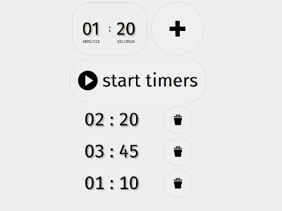
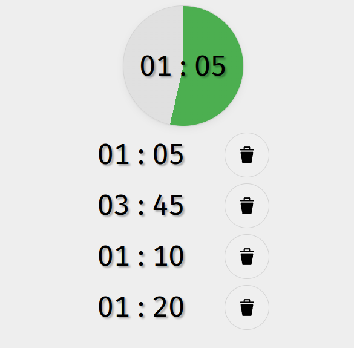

# Timer Management App ⏱️

A **TypeScript**-based timer management app that lets you **add, edit, and run timers** in real-time. Designed for simplicity and scalability, it ensures smooth and accurate timer operations.

---

## Features

- ✅ Add new timers
- ✅ Remove existing timers
- ✅ Start timers
- ✅ Watch timers progress live

---

## Screenshots

### Timer List

### Timer Running

---

## Technologies Used

- **TypeScript**
- **React**

---

